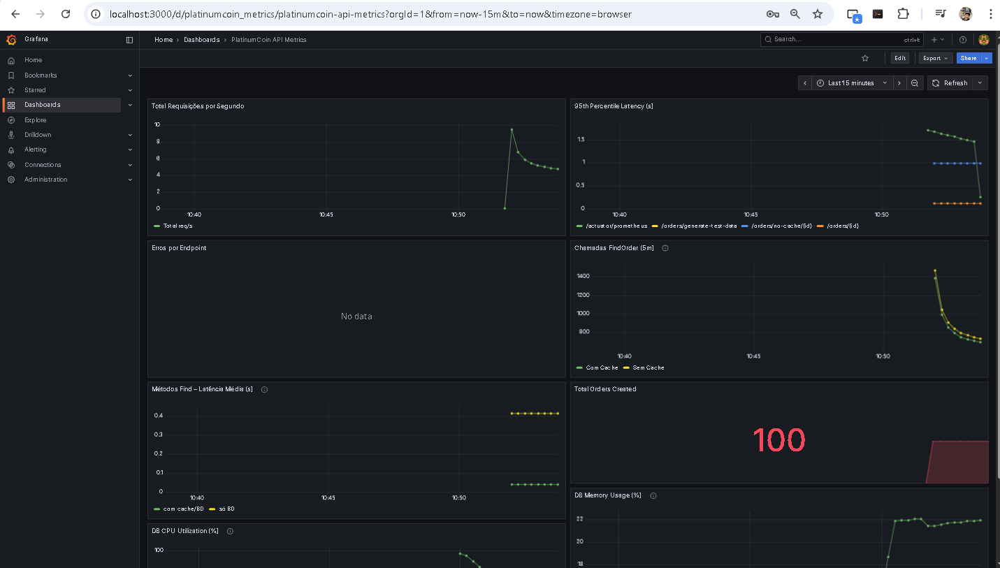
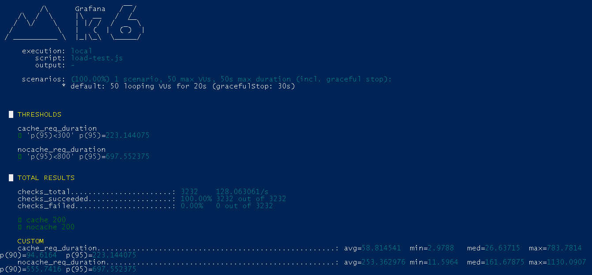

# PlatinumCoin Observability – Metrics
**Métricas com Prometheus + Grafana para microsserviços Java (Micrometer + Spring Boot Actuator)**

---

## 📖 Visão Geral

O **PlatinumCoin Observability – Metrics** entrega uma base simples e completa para **observabilidade por métricas** em serviços Java, com:

- Exposição de métricas via **Micrometer + Spring Boot Actuator**.
- Coleta e armazenamento com **Prometheus**.
- Visualização com **Grafana** usando **dashboards prontos** e queries PromQL já validadas.
- **Docker Compose** para subir rapidamente Prometheus e Grafana.
- **K6** para simular tráfego e validar painéis e indicadores.

**Arquitetura (alto nível):**  
Aplicação Java (Micrometer/Actuator) → `/actuator/prometheus` → **Prometheus (scrape)** → **Grafana (dashboards)**

---

## 🎯 Por que isso é útil?

- **Tempo de resposta sob controle:** visualize **p50/p95/p99** por endpoint e identifique regressões de latência em segundos.
- **Menos incidentes e MTTR menor:** métricas de **erros (4xx/5xx)** e **saturação** (memória, threads, CPU) ajudam a agir antes de afetar o usuário.
- **Capacidade e custo otimizados:** acompanhe saturação e throughput para **dimensionar pods/instâncias** com base em dados, não em suposições.
- **Observabilidade padronizada:** um **padrão único** de métricas para todos os microsserviços, facilitando governança e auditoria.
- **Rápida detecção de regressões:** dashboards e métricas comuns permitem comparar **versões** e **releases** com clareza.
- **Pronto para SLO/SLI:** base sólida para definir **metas de disponibilidade e performance** de cada serviço.

---

## 📊 Dashboards e Métricas

**Dashboards sugeridos (ou já provisionados):**
- **JVM / Micrometer**: heap, GC, threads, CPU.
- **HTTP Server**: latência p50/p95/p99, throughput por rota, taxa de erro por status.
- **Negócio (custom)**: contadores e tempos de processos-chave (ex.: criação e processamento de pedidos).

**Principais métricas (Golden Signals + Negócio):**
- **Latência**: histogramas por endpoint para p50/p95/p99.
- **Tráfego**: requisições por segundo.
- **Erros**: 4xx e 5xx por endpoint e total.
- **Saturação**: memória usada vs. máxima, threads, CPU.
- **Negócio**: contadores e timers de casos críticos (ex.: `orders_created_total`, tempo de processamento).

---

## 🧩 Estrutura do Repositório

- `src/main/` – Aplicação Java com Actuator/Micrometer expondo `/actuator/prometheus`.
- `observability/` – Provisionamento do Grafana (datasources/dashboards) e configuração do Prometheus.
- `k6-loadtest/` – Scripts de carga para validar métricas e gráficos.
- `docker-compose.yml` – Sobe **Prometheus (9090)** e **Grafana (3000)** rapidamente.

---

## ⚙️ Como executar (resumo)

1. **Subir Prometheus + Grafana** com Docker Compose.
2. **Iniciar a aplicação** localmente com Actuator habilitado.
3. **Acessar o Prometheus** para checar o alvo em “Targets” (status “UP”).
4. **Acessar o Grafana** (login inicial) e conferir se os **dashboards** estão carregados e recebendo dados.

> Dicas:
> - Em ambientes Windows/Mac, a aplicação local pode ser descoberta pelos containers via `host.docker.internal`. Em algumas distros Linux, use o gateway do Docker.
> - Ajuste o fuso horário para **America/Sao_Paulo** nos containers (Prometheus/Grafana) para alinhar horários de gráficos.

---
## 🔬 Validação com K6 (opcional)

A pasta `k6-loadtest/` inclui scripts para:
- Simular **carga leve** e verificar comportamento de **latência** e **erros**.
- Aquecer endpoints “quentes” para observar diferença entre **warm-up** e **regime estável**.
- Suportar comparações antes/depois de uma alteração de código ou configuração.

---

## 🧭 Troubleshooting

- **Sem dados no Grafana**: verifique o datasource (Prometheus) e o intervalo de tempo do dashboard.
- **Prometheus não coleta**: confira o alvo (host/porta), o caminho `/actuator/prometheus` e a rede entre containers e host.
- **Latência alta inesperada**: investigue p95/p99 do endpoint, erros 5xx, threads bloqueadas, GC e saturação de heap.
- **Ambientes Linux**: se `host.docker.internal` não existe, use o IP do gateway do Docker ou rede “host”.

---

## 🔒 Segurança e Governança

- Usuários e teams do Grafana podem ser gerenciados por **orgs, folders e permissões**.
- Painéis e datasources podem ser **versionados** no repositório (`observability/`) e aplicados por CI/CD.
- Alertas (no Prometheus ou Grafana) permitem acionar **on-call** com base em p95, taxa de erro e saturação.

---

## 🚀 Tecnologias

- **Java 21**, **Spring Boot 3.x**, **Micrometer**, **Spring Boot Actuator**
- **Prometheus 2.x**, **Grafana 10+**
- **Docker Compose**
- **K6** (simulação de carga)

---

## 📌 Próximos Passos

- **Provisionamento completo** do Grafana por arquivos (datasources, dashboards e alerts) para facilitar CI/CD.
- **Alertas operacionais e de negócio** (ex.: p95 acima do SLO, 5xx em pico, backlog de processamento).
- Integração com **exporters adicionais** (node_exporter, blackbox_exporter) e malha de serviços (Service Mesh) se aplicável.
- Publicar imagens e configs padronizadas para **dev/hml/prd**, fortalecendo governança.

---

Feito para acelerar sua **observabilidade por métricas** com uma base simples, padronizada e pronta para te dar insights. 💪
